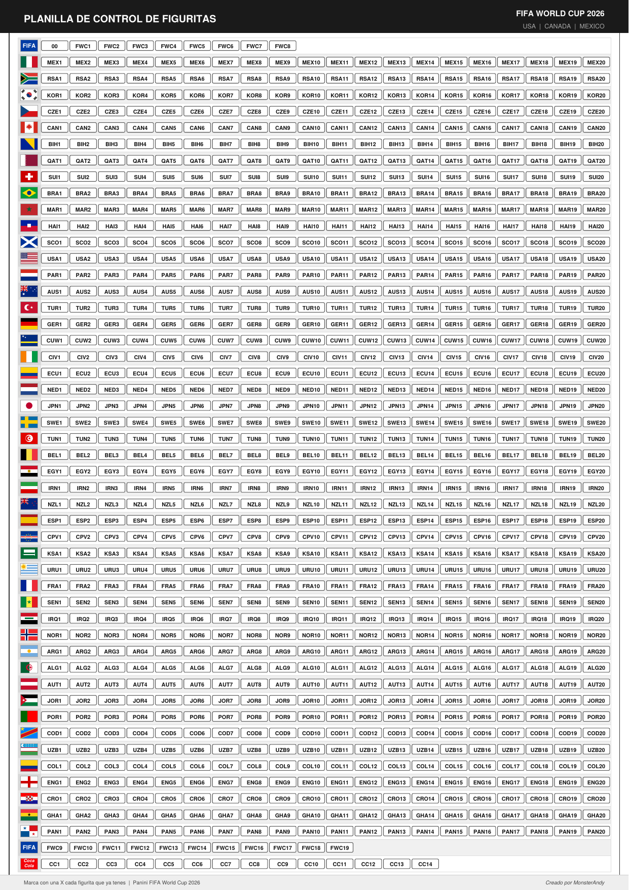

# 🏆 Planilla de Control de Figuritas — FIFA World Cup 2026

Planilla gratuita para imprimir y controlar las figuritas del álbum **Panini FIFA World Cup 2026** (USA · Canada · Mexico).

---

## 📥 Descarga

👉 **[Descargar PDF para imprimir](figuritas_mundial_2026.pdf)**

---

## ✅ Cómo usar

1. Imprimí la planilla en una hoja A4 (recomendado: blanco y negro)
2. Tachá con una **X** cada figurita repetida que tenés
3. Usala para intercambiar con amigos

---

## 📋 Contenido de la planilla

La planilla cubre **todas las figuritas del álbum**, en orden:

| Sección | Figuritas |
|---|---|
| Introducción | `00`, `FWC1` – `FWC8` |
| 48 selecciones | `MEX1`–`MEX20`, `RSA1`–`RSA20` … `PAN1`–`PAN20` |
| Extra Mundial | `FWC9` – `FWC19` |
| Coca-Cola | `CC1` – `CC14` |

Cada selección tiene su **bandera** y **20 casilleros** para tachar.

---

## 🌍 Selecciones incluidas

MEX · RSA · KOR · CZE · CAN · BIH · QAT · SUI · BRA · MAR · HAI · SCO · USA · PAR · AUS · TUR · GER · CUW · CIV · ECU · NED · JPN · SWE · TUN · BEL · EGY · IRN · NZL · ESP · CPV · KSA · URU · FRA · SEN · IRQ · NOR · ARG · ALG · AUT · JOR · POR · COD · UZB · COL · ENG · CRO · GHA · PAN

---

## 🖨️ Impresión

- Tamaño: **A4**
- Modo: **Blanco y negro** (optimizado para ahorrar tinta)
- Páginas: **1 página**

---

## 📄 Licencia

Gratis para uso personal. Creado con ❤️ por **MonsterAndy**.

---

*Panini y FIFA World Cup son marcas registradas de sus respectivos dueños. Esta planilla es un recurso fan-made sin fines de lucro.*
